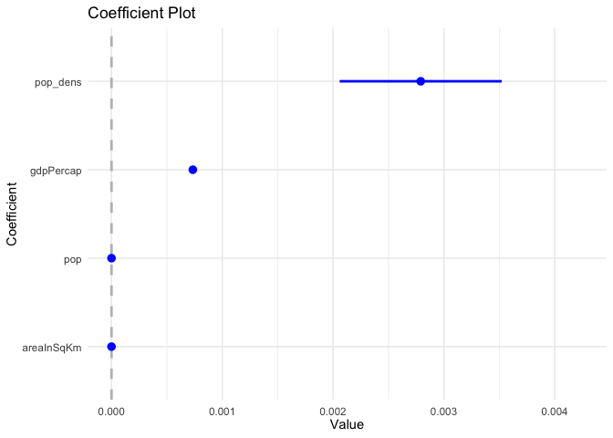

Effect of Population Density on Life Expectancy
================
Ojaswi Malik
2020-06-01

## Setup

``` r
library(tidyverse)
```

    ## ── Attaching packages ─────────────────────────────────────── tidyverse 1.3.0 ──

    ## ✓ ggplot2 3.3.0     ✓ purrr   0.3.4
    ## ✓ tibble  3.0.0     ✓ dplyr   0.8.5
    ## ✓ tidyr   1.0.2     ✓ stringr 1.4.0
    ## ✓ readr   1.3.1     ✓ forcats 0.5.0

    ## ── Conflicts ────────────────────────────────────────── tidyverse_conflicts() ──
    ## x dplyr::filter() masks stats::filter()
    ## x dplyr::lag()    masks stats::lag()

``` r
library(coefplot)
#loading gapminder() package
library(gapminder)
#loading geonames() package
library(geonames)
#loading countrycode() package
library(countrycode)

#retrieve API key stored in .Rprofile
key <- getOption("geonamesUsername")

#setting theme
theme_set(theme_minimal())
```

## Analysis

``` r
#glimpsing the gapminder data
glimpse(gapminder)
```

    ## Rows: 1,704
    ## Columns: 6
    ## $ country   <fct> Afghanistan, Afghanistan, Afghanistan, Afghanistan, Afghani…
    ## $ continent <fct> Asia, Asia, Asia, Asia, Asia, Asia, Asia, Asia, Asia, Asia,…
    ## $ year      <int> 1952, 1957, 1962, 1967, 1972, 1977, 1982, 1987, 1992, 1997,…
    ## $ lifeExp   <dbl> 28.801, 30.332, 31.997, 34.020, 36.088, 38.438, 39.854, 40.…
    ## $ pop       <int> 8425333, 9240934, 10267083, 11537966, 13079460, 14880372, 1…
    ## $ gdpPercap <dbl> 779.4453, 820.8530, 853.1007, 836.1971, 739.9811, 786.1134,…

``` r
# 1.loading the country information using geonames 
countryInfo <- GNcountryInfo()

# 2. using countrycode() to make country names format  same for both datasets 
countryInfo <- countryInfo %>%
  mutate(country = countrycode(sourcevar = countryInfo$countryCode, origin = "iso2c", destination = "country.name"))

# 2. Joining the 2 datsets and 3. Calculating population density
joined <- gapminder %>%
  left_join(countryInfo, by = "country" ) %>%
  #converting area into numeric to use it to calculate pop density
  mutate(areaInSqKm = as.numeric(areaInSqKm)) %>%
  mutate(pop_dens = pop/areaInSqKm) 

# 4. Plotting graph with population density
joined %>%
  ggplot(mapping = aes(x = pop_dens, y=lifeExp )) +
  geom_point(alpha = 0.1) +
  geom_smooth() + 
  scale_x_log10() +
  labs(
    title = "Relationship between Population Density and Life Expectancy",
    x = "Population Density (Population/Area in Square KM)",
    y = "Average Life Expectancy"
  )
```

<!-- -->

``` r
# Comparing across continents
joined %>%
  #dropping NA values
  drop_na(continentName) %>%
  group_by(continentName) %>%
  ggplot(mapping = aes(x = pop_dens, y=lifeExp, color = continentName )) +
  geom_point(alpha = 0.1) +
  geom_smooth() + 
  scale_x_log10() +
  labs(
    title = "Relationship between Population Density and Life Expectancy",
    subtitle = "Difference across continents",
    x = "Population Density (Population/Area in Square KM)",
    y = "Average Life Expectancy",
    color = "Continent Name"
  ) + 
  theme(legend.position = "bottom")
```

<!-- -->

**Observation** :

  - **Overall**: As population density increases, the average life
    expectancy increases. Moreover, the rate of growth increases as
    population density nears 100.

  - **Across continents**: Notably, Asia has the highest population
    density and follows the general trend i.e. as population density
    increases, the average life expectancy increases. Similiarly, Africa
    also has higher life expectancy when population density increases.
    Both Oceania and North America seem to have “W” shaped graphs,
    implying higher population density having initially lower high
    expectancy, but later there are high and low life expectancies as
    population density increases. Moreover, both Oceania and North
    America have higher average life expectancy that Asia and Africa.
    South America has a sharp rise in average life expectancy as
    population density increases. Europe initially has a negative
    relationship between the 2 variables, but for higher values of
    population density it has higher averae life expectancy.

## Coefficient Plot

This coefficient plot estimates a linear regression model for predicting
Average life expectancy as a function of GDP per capital, Area in Sq KM,
and population density.

``` r
#constructing OLS model
exp_mod <- lm(lifeExp ~ pop + gdpPercap + areaInSqKm + pop_dens,
              data = joined)

#creating the plot
coefplot(exp_mod, sort = "magnitude", intercept = FALSE)
```

<!-- --> \#\#
Observation: As we saw in the smoothing line above, population density
has a positive relationship with average life expectancy.But it also has
high variance. The other 3 coefficients: GDP per capital, Area in Sq KM,
and population density also have a positive relationship
    respectively.

## Session Info

``` r
devtools::session_info()
```

    ## ─ Session info ───────────────────────────────────────────────────────────────
    ##  setting  value                       
    ##  version  R version 3.6.3 (2020-02-29)
    ##  os       macOS Catalina 10.15.4      
    ##  system   x86_64, darwin15.6.0        
    ##  ui       X11                         
    ##  language (EN)                        
    ##  collate  en_US.UTF-8                 
    ##  ctype    en_US.UTF-8                 
    ##  tz       Asia/Kolkata                
    ##  date     2020-06-01                  
    ## 
    ## ─ Packages ───────────────────────────────────────────────────────────────────
    ##  package     * version date       lib source        
    ##  assertthat    0.2.1   2019-03-21 [1] CRAN (R 3.6.0)
    ##  backports     1.1.6   2020-04-05 [1] CRAN (R 3.6.2)
    ##  broom         0.5.5   2020-02-29 [1] CRAN (R 3.6.0)
    ##  callr         3.4.3   2020-03-28 [1] CRAN (R 3.6.2)
    ##  cellranger    1.1.0   2016-07-27 [1] CRAN (R 3.6.0)
    ##  cli           2.0.2   2020-02-28 [1] CRAN (R 3.6.0)
    ##  coefplot    * 1.2.6   2018-02-07 [1] CRAN (R 3.6.0)
    ##  colorspace    1.4-1   2019-03-18 [1] CRAN (R 3.6.0)
    ##  countrycode * 1.2.0   2020-05-22 [1] CRAN (R 3.6.2)
    ##  crayon        1.3.4   2017-09-16 [1] CRAN (R 3.6.0)
    ##  DBI           1.1.0   2019-12-15 [1] CRAN (R 3.6.0)
    ##  dbplyr        1.4.3   2020-04-19 [1] CRAN (R 3.6.3)
    ##  desc          1.2.0   2018-05-01 [1] CRAN (R 3.6.0)
    ##  devtools      2.3.0   2020-04-10 [1] CRAN (R 3.6.3)
    ##  digest        0.6.25  2020-02-23 [1] CRAN (R 3.6.0)
    ##  dplyr       * 0.8.5   2020-03-07 [1] CRAN (R 3.6.0)
    ##  ellipsis      0.3.0   2019-09-20 [1] CRAN (R 3.6.0)
    ##  evaluate      0.14    2019-05-28 [1] CRAN (R 3.6.0)
    ##  fansi         0.4.1   2020-01-08 [1] CRAN (R 3.6.0)
    ##  farver        2.0.3   2020-01-16 [1] CRAN (R 3.6.0)
    ##  forcats     * 0.5.0   2020-03-01 [1] CRAN (R 3.6.0)
    ##  fs            1.4.1   2020-04-04 [1] CRAN (R 3.6.2)
    ##  gapminder   * 0.3.0   2017-10-31 [1] CRAN (R 3.6.0)
    ##  generics      0.0.2   2018-11-29 [1] CRAN (R 3.6.0)
    ##  geonames    * 0.999   2019-02-19 [1] CRAN (R 3.6.0)
    ##  ggplot2     * 3.3.0   2020-03-05 [1] CRAN (R 3.6.0)
    ##  glue          1.4.0   2020-04-03 [1] CRAN (R 3.6.2)
    ##  gtable        0.3.0   2019-03-25 [1] CRAN (R 3.6.0)
    ##  haven         2.2.0   2019-11-08 [1] CRAN (R 3.6.0)
    ##  hms           0.5.3   2020-01-08 [1] CRAN (R 3.6.0)
    ##  htmltools     0.4.0   2019-10-04 [1] CRAN (R 3.6.0)
    ##  httr          1.4.1   2019-08-05 [1] CRAN (R 3.6.0)
    ##  jsonlite      1.6.1   2020-02-02 [1] CRAN (R 3.6.0)
    ##  knitr         1.28    2020-02-06 [1] CRAN (R 3.6.0)
    ##  labeling      0.3     2014-08-23 [1] CRAN (R 3.6.0)
    ##  lattice       0.20-38 2018-11-04 [1] CRAN (R 3.6.3)
    ##  lifecycle     0.2.0   2020-03-06 [1] CRAN (R 3.6.0)
    ##  lubridate     1.7.8   2020-04-06 [1] CRAN (R 3.6.2)
    ##  magrittr      1.5     2014-11-22 [1] CRAN (R 3.6.0)
    ##  Matrix        1.2-18  2019-11-27 [1] CRAN (R 3.6.3)
    ##  memoise       1.1.0   2017-04-21 [1] CRAN (R 3.6.0)
    ##  mgcv          1.8-31  2019-11-09 [1] CRAN (R 3.6.3)
    ##  modelr        0.1.6   2020-02-22 [1] CRAN (R 3.6.0)
    ##  munsell       0.5.0   2018-06-12 [1] CRAN (R 3.6.0)
    ##  nlme          3.1-144 2020-02-06 [1] CRAN (R 3.6.3)
    ##  pillar        1.4.3   2019-12-20 [1] CRAN (R 3.6.0)
    ##  pkgbuild      1.0.6   2019-10-09 [1] CRAN (R 3.6.0)
    ##  pkgconfig     2.0.3   2019-09-22 [1] CRAN (R 3.6.0)
    ##  pkgload       1.0.2   2018-10-29 [1] CRAN (R 3.6.0)
    ##  plyr          1.8.6   2020-03-03 [1] CRAN (R 3.6.0)
    ##  prettyunits   1.1.1   2020-01-24 [1] CRAN (R 3.6.0)
    ##  processx      3.4.2   2020-02-09 [1] CRAN (R 3.6.0)
    ##  ps            1.3.2   2020-02-13 [1] CRAN (R 3.6.0)
    ##  purrr       * 0.3.4   2020-04-17 [1] CRAN (R 3.6.2)
    ##  R6            2.4.1   2019-11-12 [1] CRAN (R 3.6.0)
    ##  Rcpp          1.0.4.6 2020-04-09 [1] CRAN (R 3.6.3)
    ##  readr       * 1.3.1   2018-12-21 [1] CRAN (R 3.6.0)
    ##  readxl        1.3.1   2019-03-13 [1] CRAN (R 3.6.0)
    ##  remotes       2.1.1   2020-02-15 [1] CRAN (R 3.6.0)
    ##  reprex        0.3.0   2019-05-16 [1] CRAN (R 3.6.0)
    ##  reshape2      1.4.4   2020-04-09 [1] CRAN (R 3.6.2)
    ##  rjson         0.2.20  2018-06-08 [1] CRAN (R 3.6.0)
    ##  rlang         0.4.5   2020-03-01 [1] CRAN (R 3.6.0)
    ##  rmarkdown     2.1     2020-01-20 [1] CRAN (R 3.6.0)
    ##  rprojroot     1.3-2   2018-01-03 [1] CRAN (R 3.6.0)
    ##  rstudioapi    0.11    2020-02-07 [1] CRAN (R 3.6.0)
    ##  rvest         0.3.5   2019-11-08 [1] CRAN (R 3.6.0)
    ##  scales        1.1.0   2019-11-18 [1] CRAN (R 3.6.0)
    ##  sessioninfo   1.1.1   2018-11-05 [1] CRAN (R 3.6.0)
    ##  stringi       1.4.6   2020-02-17 [1] CRAN (R 3.6.0)
    ##  stringr     * 1.4.0   2019-02-10 [1] CRAN (R 3.6.0)
    ##  testthat      2.3.2   2020-03-02 [1] CRAN (R 3.6.0)
    ##  tibble      * 3.0.0   2020-03-30 [1] CRAN (R 3.6.2)
    ##  tidyr       * 1.0.2   2020-01-24 [1] CRAN (R 3.6.0)
    ##  tidyselect    1.0.0   2020-01-27 [1] CRAN (R 3.6.0)
    ##  tidyverse   * 1.3.0   2019-11-21 [1] CRAN (R 3.6.0)
    ##  useful        1.2.6   2018-10-08 [1] CRAN (R 3.6.0)
    ##  usethis       1.6.0   2020-04-09 [1] CRAN (R 3.6.3)
    ##  utf8          1.1.4   2018-05-24 [1] CRAN (R 3.6.0)
    ##  vctrs         0.2.4   2020-03-10 [1] CRAN (R 3.6.0)
    ##  withr         2.1.2   2018-03-15 [1] CRAN (R 3.6.0)
    ##  xfun          0.13    2020-04-13 [1] CRAN (R 3.6.2)
    ##  xml2          1.3.1   2020-04-09 [1] CRAN (R 3.6.2)
    ##  yaml          2.2.1   2020-02-01 [1] CRAN (R 3.6.0)
    ## 
    ## [1] /Library/Frameworks/R.framework/Versions/3.6/Resources/library
