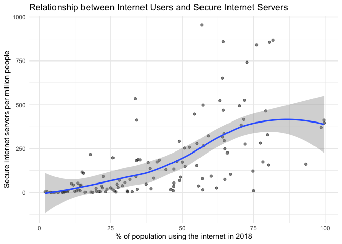

Web Scraping - Internet Usage Data
================
Ojaswi Malik
2020-06-01

## Scraping the data

``` r
#reading the website
read <- read_html("http://wdi.worldbank.org/table/5.12")

#selecting the elements with css table
table <- html_nodes(read, css = "table") 

#choosing the 3rd table and renaming the headers of the columns
internet_data <- html_table(table, fill = TRUE)[[3]] %>%
  as_tibble() %>%
  rename(
    "Country" = 1,
    "2018_Internet_Usage" = 2,
    "2018_Secure_Internet_servers" = 3,
    "2017_Goods_Exports" = 4,
    "2017_Goods_Imports" = 5,
    "2017_Services_Exports" = 6
  )

#converting all data in the table to numeric so we can analyse it
new_internet_data <- internet_data %>%
  mutate(
    `2018_Internet_Usage` = as.numeric(`2018_Internet_Usage`),
    `2018_Secure_Internet_servers`= as.numeric(`2018_Secure_Internet_servers`),
    `2017_Goods_Exports` = as.numeric(`2017_Goods_Exports`),
    `2017_Goods_Imports` = as.numeric(`2017_Goods_Imports`),
    `2017_Services_Exports` = as.numeric(`2017_Services_Exports`)
  )

#deleting rows from 218 to 264 because those are not countries
new_internet_data <- new_internet_data[-c(218:264), ]
```

## Analysis

### 1\. Relationship between Internet Users and Secure Internet Servers

``` r
new_internet_data %>%
  ggplot(aes(x = `2018_Internet_Usage`, y = `2018_Secure_Internet_servers`)) + 
  geom_point(alpha = 0.5) + 
  #using a smoothing line to visualise the relationship
  geom_smooth() + 
  labs(
    title = "Relationship between Internet Users and Secure Internet Servers",
    x = "% of population using the internet in 2018",
    y = "Secure internet servers per million people"
  )
```

<!-- -->

### Observation:

The general trend shows that as the percentage of population using the
internet increases, the number of secure internet servers also
increases. This makes sense as a country would need higher number of
servers to support large internet user in their population.

### 2\. Ranking all countries in order of Internet Users in 2018

``` r
new_internet_data %>%
  #removing NA values
  drop_na(`2018_Internet_Usage`) %>%
  #in descending order of 2018 internet usage
  ggplot(aes(x = fct_reorder(Country, `2018_Internet_Usage`), y = `2018_Internet_Usage`)) + 
  geom_col() +
  #highlighting USA in blue
  geom_col(data = new_internet_data %>%
             filter(Country == "United States"), 
           fill = "dodgerblue") +
  coord_flip() +
  labs(
    title = "Countries in order of internet users",
    subtitle = "USA highlighted",
    y = "% of population using the internet in 2018",
    x = "Country"
  )
```

<!-- -->

### Observation:

Plotting all 216 countries, this yields a very large plot. Comparing the
first and last countries there is big difference of about 98% of
population using the internet. I have also highlighted the US’s position
in blue which is in the top 25% of all countries. In the next analyses,
I will narrow down the list of countries.

### 3\. Focusing on top 15 countries

``` r
#getting only the top 15 countries from the above graph
top_15 <- top_n(new_internet_data, 15, `2018_Internet_Usage`)

top_15 %>%
  drop_na(`2018_Internet_Usage`) %>%
  ggplot(aes(x = fct_reorder(Country, `2018_Internet_Usage`), y = `2018_Internet_Usage`)) + 
  geom_col() +
  coord_flip() +
    labs(
    title = "Top 15 countries in order of internet users",
    y = "% of population using the internet in 2018",
    x = "Country"
  )
```

<!-- -->

### Observation:

These top 15 countries are really close in their percentage of
population on the internet. The leading country is
Qatar.

### 4\. For these top 15 countries plotting good exports, imports and service exports in 2017

``` r
#for 2017 goods exports
top_15 %>%
  drop_na(`2017_Goods_Exports`) %>%
  ggplot() +
  geom_col(aes(x = Country, y = `2017_Goods_Exports`), fill = "red") +
  coord_flip() + 
  labs(
    title = "Country wise goods exports",
    x = "Country",
    y = "% of total goods exports in 2017"
  )
```

<!-- -->

``` r
#for 2017 goods imports
top_15 %>%
  drop_na(`2017_Goods_Imports`) %>%
  ggplot() +
  geom_col(aes(x = Country, y = `2017_Goods_Imports`), fill = "blue") +
  coord_flip() +
  labs(
    title = "Country wise goods imports",
    x = "Country",
    y = "% of total goods imports in 2017"
  )
```

<!-- -->

``` r
#for 2017 services exports
top_15 %>%
  drop_na(`2017_Services_Exports`) %>%
  ggplot() +
  geom_col(aes(x = Country, y = `2017_Services_Exports`), fill = "purple") +
  coord_flip() +
  labs(
    title = "Country wise services exports",
    x = "Country",
    y = "% of total services exports in 2017"
  )
```

<!-- -->

### Observation:

  - **Goods, Exports**: Despite being the country with the highest % of
    internet users, Qatar has the lowest % of goods exports. Korea has
    the largest percentage of goods exported in 2017.

  - **Goods, Imports**: Korea also has the largest percentage of goods
    imported in 2017.

  - **Services, Exports**: Kuwait has the largest percentage of services
    exported in 2017.

### 5\. Coefficient Plot

This coefficient plot estimates a linear regression model for predicting
2018 Internet Usage on average as a function of secure internet servers
in 2018, goods exported and imported in 2017, and services exported in
2017.

``` r
#OLS model
users_mod <- lm(`2018_Internet_Usage` ~ 
                  `2018_Secure_Internet_servers` + 
                  `2017_Goods_Exports` +
                  `2017_Goods_Imports` +
                  `2017_Services_Exports`,
                data = new_internet_data
                  )

#generating the coefficient plot
coefplot(users_mod, sort = "magnitude", intercept = FALSE)
```

<!-- -->

### Observation

The relationships highlighted from this plot:

  - As good imported increases, there is a higher percentage of users on
    the internet on average.

  - As secure internet servers increases, there are a higher % of
    internet users. Although, this relationship is not as strong as with
    goods imported.

  - As services exported and goods exported increases, there is a fewer
    percentage of users on the internet on
    average.

## Session Info

``` r
devtools::session_info()
```

    ## ─ Session info ───────────────────────────────────────────────────────────────
    ##  setting  value                       
    ##  version  R version 3.6.3 (2020-02-29)
    ##  os       macOS Catalina 10.15.4      
    ##  system   x86_64, darwin15.6.0        
    ##  ui       X11                         
    ##  language (EN)                        
    ##  collate  en_US.UTF-8                 
    ##  ctype    en_US.UTF-8                 
    ##  tz       Asia/Kolkata                
    ##  date     2020-06-01                  
    ## 
    ## ─ Packages ───────────────────────────────────────────────────────────────────
    ##  package     * version date       lib source        
    ##  assertthat    0.2.1   2019-03-21 [1] CRAN (R 3.6.0)
    ##  backports     1.1.6   2020-04-05 [1] CRAN (R 3.6.2)
    ##  broom         0.5.5   2020-02-29 [1] CRAN (R 3.6.0)
    ##  callr         3.4.3   2020-03-28 [1] CRAN (R 3.6.2)
    ##  cellranger    1.1.0   2016-07-27 [1] CRAN (R 3.6.0)
    ##  cli           2.0.2   2020-02-28 [1] CRAN (R 3.6.0)
    ##  coefplot    * 1.2.6   2018-02-07 [1] CRAN (R 3.6.0)
    ##  colorspace    1.4-1   2019-03-18 [1] CRAN (R 3.6.0)
    ##  crayon        1.3.4   2017-09-16 [1] CRAN (R 3.6.0)
    ##  curl          4.3     2019-12-02 [1] CRAN (R 3.6.0)
    ##  DBI           1.1.0   2019-12-15 [1] CRAN (R 3.6.0)
    ##  dbplyr        1.4.3   2020-04-19 [1] CRAN (R 3.6.3)
    ##  desc          1.2.0   2018-05-01 [1] CRAN (R 3.6.0)
    ##  devtools      2.3.0   2020-04-10 [1] CRAN (R 3.6.3)
    ##  digest        0.6.25  2020-02-23 [1] CRAN (R 3.6.0)
    ##  dplyr       * 0.8.5   2020-03-07 [1] CRAN (R 3.6.0)
    ##  ellipsis      0.3.0   2019-09-20 [1] CRAN (R 3.6.0)
    ##  evaluate      0.14    2019-05-28 [1] CRAN (R 3.6.0)
    ##  fansi         0.4.1   2020-01-08 [1] CRAN (R 3.6.0)
    ##  farver        2.0.3   2020-01-16 [1] CRAN (R 3.6.0)
    ##  forcats     * 0.5.0   2020-03-01 [1] CRAN (R 3.6.0)
    ##  fs            1.4.1   2020-04-04 [1] CRAN (R 3.6.2)
    ##  generics      0.0.2   2018-11-29 [1] CRAN (R 3.6.0)
    ##  ggplot2     * 3.3.0   2020-03-05 [1] CRAN (R 3.6.0)
    ##  glue          1.4.0   2020-04-03 [1] CRAN (R 3.6.2)
    ##  gtable        0.3.0   2019-03-25 [1] CRAN (R 3.6.0)
    ##  haven         2.2.0   2019-11-08 [1] CRAN (R 3.6.0)
    ##  hms           0.5.3   2020-01-08 [1] CRAN (R 3.6.0)
    ##  htmltools     0.4.0   2019-10-04 [1] CRAN (R 3.6.0)
    ##  httr          1.4.1   2019-08-05 [1] CRAN (R 3.6.0)
    ##  jsonlite      1.6.1   2020-02-02 [1] CRAN (R 3.6.0)
    ##  knitr         1.28    2020-02-06 [1] CRAN (R 3.6.0)
    ##  labeling      0.3     2014-08-23 [1] CRAN (R 3.6.0)
    ##  lattice       0.20-38 2018-11-04 [1] CRAN (R 3.6.3)
    ##  lifecycle     0.2.0   2020-03-06 [1] CRAN (R 3.6.0)
    ##  lubridate     1.7.8   2020-04-06 [1] CRAN (R 3.6.2)
    ##  magrittr      1.5     2014-11-22 [1] CRAN (R 3.6.0)
    ##  Matrix        1.2-18  2019-11-27 [1] CRAN (R 3.6.3)
    ##  memoise       1.1.0   2017-04-21 [1] CRAN (R 3.6.0)
    ##  mgcv          1.8-31  2019-11-09 [1] CRAN (R 3.6.3)
    ##  modelr        0.1.6   2020-02-22 [1] CRAN (R 3.6.0)
    ##  munsell       0.5.0   2018-06-12 [1] CRAN (R 3.6.0)
    ##  nlme          3.1-144 2020-02-06 [1] CRAN (R 3.6.3)
    ##  pillar        1.4.3   2019-12-20 [1] CRAN (R 3.6.0)
    ##  pkgbuild      1.0.6   2019-10-09 [1] CRAN (R 3.6.0)
    ##  pkgconfig     2.0.3   2019-09-22 [1] CRAN (R 3.6.0)
    ##  pkgload       1.0.2   2018-10-29 [1] CRAN (R 3.6.0)
    ##  plyr          1.8.6   2020-03-03 [1] CRAN (R 3.6.0)
    ##  prettyunits   1.1.1   2020-01-24 [1] CRAN (R 3.6.0)
    ##  processx      3.4.2   2020-02-09 [1] CRAN (R 3.6.0)
    ##  ps            1.3.2   2020-02-13 [1] CRAN (R 3.6.0)
    ##  purrr       * 0.3.4   2020-04-17 [1] CRAN (R 3.6.2)
    ##  R6            2.4.1   2019-11-12 [1] CRAN (R 3.6.0)
    ##  Rcpp          1.0.4.6 2020-04-09 [1] CRAN (R 3.6.3)
    ##  readr       * 1.3.1   2018-12-21 [1] CRAN (R 3.6.0)
    ##  readxl        1.3.1   2019-03-13 [1] CRAN (R 3.6.0)
    ##  remotes       2.1.1   2020-02-15 [1] CRAN (R 3.6.0)
    ##  reprex        0.3.0   2019-05-16 [1] CRAN (R 3.6.0)
    ##  reshape2      1.4.4   2020-04-09 [1] CRAN (R 3.6.2)
    ##  rlang         0.4.5   2020-03-01 [1] CRAN (R 3.6.0)
    ##  rmarkdown     2.1     2020-01-20 [1] CRAN (R 3.6.0)
    ##  rprojroot     1.3-2   2018-01-03 [1] CRAN (R 3.6.0)
    ##  rstudioapi    0.11    2020-02-07 [1] CRAN (R 3.6.0)
    ##  rvest       * 0.3.5   2019-11-08 [1] CRAN (R 3.6.0)
    ##  scales        1.1.0   2019-11-18 [1] CRAN (R 3.6.0)
    ##  selectr       0.4-2   2019-11-20 [1] CRAN (R 3.6.0)
    ##  sessioninfo   1.1.1   2018-11-05 [1] CRAN (R 3.6.0)
    ##  stringi       1.4.6   2020-02-17 [1] CRAN (R 3.6.0)
    ##  stringr     * 1.4.0   2019-02-10 [1] CRAN (R 3.6.0)
    ##  testthat      2.3.2   2020-03-02 [1] CRAN (R 3.6.0)
    ##  tibble      * 3.0.0   2020-03-30 [1] CRAN (R 3.6.2)
    ##  tidyr       * 1.0.2   2020-01-24 [1] CRAN (R 3.6.0)
    ##  tidyselect    1.0.0   2020-01-27 [1] CRAN (R 3.6.0)
    ##  tidyverse   * 1.3.0   2019-11-21 [1] CRAN (R 3.6.0)
    ##  useful        1.2.6   2018-10-08 [1] CRAN (R 3.6.0)
    ##  usethis       1.6.0   2020-04-09 [1] CRAN (R 3.6.3)
    ##  vctrs         0.2.4   2020-03-10 [1] CRAN (R 3.6.0)
    ##  withr         2.1.2   2018-03-15 [1] CRAN (R 3.6.0)
    ##  xfun          0.13    2020-04-13 [1] CRAN (R 3.6.2)
    ##  xml2        * 1.3.1   2020-04-09 [1] CRAN (R 3.6.2)
    ##  yaml          2.2.1   2020-02-01 [1] CRAN (R 3.6.0)
    ## 
    ## [1] /Library/Frameworks/R.framework/Versions/3.6/Resources/library
